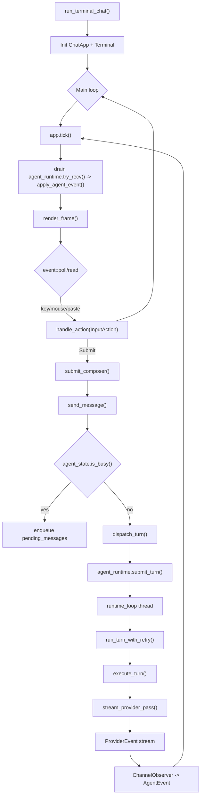
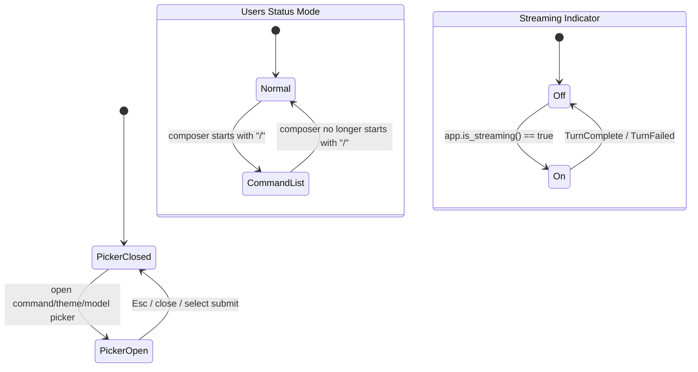
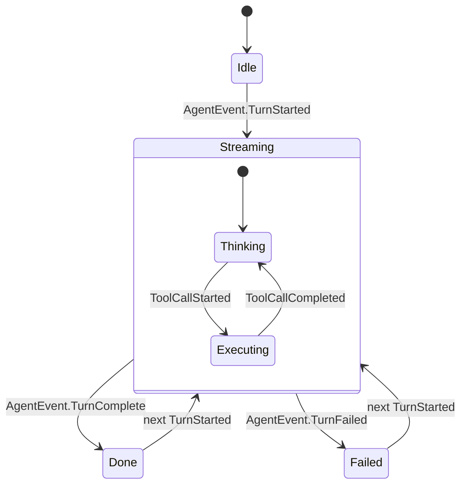

# Runtime Logic and TUI State Diagrams

This document maps current Blazar runtime flow and TUI-focused state transitions.

Code references:

- `src/chat/event_loop.rs`
- `src/chat/app.rs`
- `src/chat/app/actions.rs`
- `src/chat/app/turns.rs`
- `src/chat/app/events.rs`
- `src/chat/view/mod.rs`
- `src/chat/view/status.rs`
- `src/agent/runtime.rs`
- `src/agent/runtime/turn.rs`
- `src/agent/state.rs`

## 1) End-to-end runtime flow

## 2) TUI interaction/state graph (focus)

## 3) Agent turn state machine (drives status label)

## Rendering outputs

Rendered artifacts are generated from:

- `docs/development/diagrams/runtime-flow.mmd`
- `docs/development/diagrams/tui-state.mmd`
- `docs/development/diagrams/agent-turn-state.mmd`

Into:

- `docs/development/diagrams/runtime-flow.svg`
- `docs/development/diagrams/tui-state.svg`
- `docs/development/diagrams/agent-turn-state.svg`
